# KAYZEN TURF AI - Institutional System Design

## 1. Positionnement

KAYZEN TURF AI est une plateforme SaaS d'aide a la decision pour l'analyse hippique. Le produit ne vend pas une promesse de gain, mais un systeme d'analyse probabiliste, de detection d'ecarts de marche et de controle du risque.

Objectif cible : devenir un moteur de prediction institutionnel pour les courses francaises et europeennes, combinant data engineering, modeles tabulaires, deep learning, graph learning, calibration probabiliste et bankroll management.

## 2. Contraintes Non Negociables

- Respect des conditions d'utilisation des sources de donnees.
- Pas de contournement anti-bot, pas de bypass de protections, pas de scraping agressif.
- Sources privilegiees : APIs, flux autorises, open data, partenariats, pages publiques avec rate limits raisonnables.
- Separation stricte entre prediction, recommandation et execution de pari.
- Aucun message de gain garanti.
- Journalisation complete des versions de donnees, modeles et predictions.

## 3. Architecture Globale

```mermaid
flowchart LR
  Sources["Sources autorisees\nPMU, France Galop, open data, meteo, resultats"] --> Ingestion["Ingestion quotidienne\nAPI clients, crawlers respectueux, validation"]
  Ingestion --> Raw["Data Lake Raw\nJSON/HTML snapshots, horodatage"]
  Raw --> Normalize["Normalisation\ncourses, partants, cotes, resultats"]
  Normalize --> DB["PostgreSQL\nschema analytique"]
  DB --> Features["Feature Store\nfeatures temporelles sans fuite"]
  Features --> Models["AI Engine\nRF, XGBoost, LightGBM, MLP/LSTM, GNN"]
  Models --> Calib["Calibration\nPlatt, isotonic, shrinkage, temporal CV"]
  Calib --> Predictions["Prediction Service\nKZ Score, Top 3, Top 5, confidence"]
  DB --> Value["Value Bet Engine\nfair odds, edge, risk filters"]
  Predictions --> API["FastAPI / MCP API"]
  Value --> API
  API --> Next["Next.js SaaS Dashboard"]
  Results["Resultats quotidiens"] --> Feedback["Feedback Loop\nbacktest, drift, retraining"]
  Feedback --> Features
  Feedback --> Models
```



## 4. Data Engine

### 4.1 Sources Prioritaires

| Source | Usage | Mode recommande |
|---|---|---|
| PMU | partants, cotes, rapports, resultats | flux officiel, partenariat, pages publiques avec cache |
| France Galop | programme, resultats, cheval/jockey/entraineur | pages publiques, export si disponible |
| LeTROT / FNCH | courses trot, calendrier | source officielle ou flux autorise |
| Meteo | pluie, vent, temperature, historique piste | Open-Meteo ou Meteostat |
| Open data | enrichissement geographique et calendrier | APIs publiques |

### 4.2 Collecte

Frequences :

- J-1 : recuperation des partants et premiere analyse.
- Jour J : refresh cotes, non-partants, conditions, terrain.
- J+1 : resultats, rapports, reconciliation et scoring reel.
- Hebdomadaire : retraining ou recalibration si volume suffisant.

Pipeline :

1. `source_fetch_jobs` : collecte brute horodatee.
2. `source_parsers` : parsing par source avec tests de schema.
3. `entity_resolution` : matching chevaux, jockeys, entraineurs, hippodromes.
4. `quality_checks` : doublons, valeurs impossibles, ruptures de schema.
5. `feature_build` : features calculees uniquement avec donnees disponibles avant depart.
6. `prediction_snapshot` : stockage immuable des predictions live.

### 4.3 Politique Anti-Bot Conforme

Le systeme doit eviter toute logique de contournement. A la place :

- respect des `robots.txt` lorsque pertinent ;
- user-agent explicite ;
- backoff exponentiel ;
- cache et deduplication ;
- limites de debit par domaine ;
- monitoring des erreurs 403/429 ;
- bascule vers API/partenariat lorsque la source refuse l'automatisation.

## 5. AI Engine

### 5.1 Modeles

| Modele | Role | Pourquoi |
|---|---|---|
| Random Forest | baseline robuste | stable, interpretable, bon sanity check |
| LightGBM / XGBoost | modele principal tabulaire | performant sur donnees heterogenes |
| MLP | interactions non lineaires | complement tabulaire |
| LSTM / Temporal Transformer | sequences de forme | evolution cheval/jockey/entraineur |
| GNN | graphe cheval-jockey-entraineur-hippodrome | relations structurelles |
| RL / contextual bandit | staking et selection de pari | optimiser politique, pas predire le gagnant |

### 5.2 Cibles

- `p_win` : probabilite de victoire.
- `p_top3` : probabilite de finir dans les 3 premiers.
- `p_top5` : probabilite top 5.
- `race_playability` : jouable, risquee, a eviter.
- `confidence` : qualite de prediction, basee sur calibration, densite historique, volatilite marche.

### 5.3 Calibration

Les probabilites brutes ne doivent jamais etre exposees telles quelles. Calibration obligatoire :

- split temporel train/validation/test ;
- Platt scaling ou isotonic regression ;
- shrinkage vers le prior de peloton `1 / field_size` ;
- monitoring Brier score, log loss, Expected Calibration Error ;
- calibration separee par discipline, distance, taille de peloton si necessaire.

### 5.4 Anti Data Leakage

Regles strictes :

- jamais de split aleatoire comme validation principale ;
- features entity-level en `shift(1)` ou `expanding window` ;
- aucune statistique globale qui inclut le futur ;
- les cotes doivent etre horodatees et jointes au timestamp reel d'observation ;
- chaque prediction sauvegarde `data_cutoff_at`.

## 6. KZ Score

Le KZ Score est un score proprietaire de decision, pas seulement une probabilite.

Formule cible :

```text
KZ Score =
  35% calibrated_win_rank
+ 20% top3_probability
+ 15% market_edge
+ 10% model_consensus
+ 10% race_playability
+ 10% confidence_quality
- penalties(volatility, sparse_history, late_odds_shock, legal_risk)
```

Sorties :

- `KZ 85-100` : signal fort, mais non garanti.
- `KZ 70-84` : opportunite surveillable.
- `KZ 50-69` : faible avantage.
- `< 50` : eviter ou information insuffisante.

## 7. Value Bet Engine

Definitions :

```text
fair_odds = 1 / calibrated_probability
market_implied_probability = 1 / market_odds
edge = calibrated_probability * market_odds - 1
expected_value = stake * (calibrated_probability * market_odds - 1)
```

Regles :

- value bet seulement si `edge > threshold` ET `confidence >= min_confidence`.
- seuil dynamique selon volatilite et discipline.
- exclusion si donnees insuffisantes, odds shock, non-partant probable, course classee "a eviter".
- affichage obligatoire : probabilite, cote juste, cote marche, edge, incertitude.

## 8. Betting Copilot

Le copilote recommande, il n'execute pas.

Modules :

- profil utilisateur : prudent, equilibre, agressif ;
- bankroll : capital declare, mise max, drawdown ;
- selection pari : simple gagnant/place, couple, trio, multi/quinte plus tard ;
- staking : fractional Kelly, plafonds, drawdown throttle ;
- historique : ROI, hit rate, variance, discipline/course.

Politique de mise par defaut :

- 25% Kelly ;
- plafond 5% bankroll par pari ;
- reduction drawdown :
  - 0-10% : x1
  - 10-15% : x0.75
  - 15-25% : x0.5
  - 25-35% : x0.25
  - >35% : x0.1 ou pause.

## 9. Base de Donnees

Tables principales :

```text
sources
ingestion_runs
racecourses
races
race_conditions
horses
jockeys
trainers
owners
entries
odds_snapshots
results
model_versions
feature_snapshots
prediction_runs
predictions
value_bets
user_profiles
bankrolls
bet_simulations
bet_journal
responsible_gaming_events
audit_logs
```

Contraintes :

- `prediction_runs.data_cutoff_at` obligatoire.
- `odds_snapshots.observed_at` obligatoire.
- aucune prediction mutable apres publication ; corrections via nouvelle version.
- index par `race_date`, `race_id`, `horse_id`, `model_version`.

## 10. API / MCP

Version publique B2B :

| Endpoint | Methode | Description |
|---|---|---|
| `/api/races?date=YYYY-MM-DD` | GET | courses du jour/demain/historique |
| `/api/races/{raceId}` | GET | detail course |
| `/api/predictions?raceId=` | GET | probabilites, KZ Score, explications |
| `/api/value-bets?date=` | GET | opportunites filtrees |
| `/api/simulate` | POST | simulation stake/bankroll |
| `/api/model-card` | GET | version modele, calibration, limites |
| `/api/performance` | GET | metriques agregees |
| `/api/mcp/context` | GET | contexte structure pour agents/bots |

Exemple `POST /api/simulate` :

```json
{
  "raceId": "2026-05-03-R1C3",
  "horseId": "h-8",
  "stake": 25,
  "bankroll": 500,
  "drawdown": 12,
  "profile": "balanced"
}
```

## 11. UX SaaS

Ecrans :

1. Dashboard jour J : courses, filtres, alerts, value bets.
2. Race Analysis : classement chevaux, probabilites, explications.
3. Copilot : simulation de mise, profil risque, bankroll.
4. Calendar : hier, aujourd'hui, demain, comparaison.
5. Performance : backtest, live ROI, calibration, model drift.
6. API Console : clefs, quotas, exemples MCP.
7. Responsible Gaming : limites, rappels, auto-exclusion produit.

## 12. Auto-Learning

Boucle quotidienne :

1. Collecte resultats J-1.
2. Reconciliation avec predictions publiees.
3. Calcul metriques : Brier, log loss, hit rate, ROI simule, CLV.
4. Detection drift : distribution features, odds, resultats.
5. Recalibration si degradation.
6. Retraining hebdomadaire ou conditionnel.
7. Promotion modele seulement si validation temporelle superieure au modele courant.

Regle de promotion :

- aucun modele ne passe en prod sans backtest walk-forward ;
- comparaison au champion actuel ;
- rapport automatique versionne ;
- rollback possible.

## 13. Conformite France / ANJ

Principes :

- le service doit etre presente comme aide a l'analyse, pas comme operateur de pari ;
- ne pas collecter de mises reelles ni executer de paris sans cadre juridique specifique ;
- pas de promesse de gains ;
- messages de jeu responsable visibles ;
- interdiction mineurs ;
- limites volontaires et alertes de comportement a risque pour les comptes utilisateurs.

Points a valider avec conseil juridique :

- statut exact si affiliation vers operateurs agrees ;
- formulation marketing ;
- collecte de donnees utilisateur liee au comportement de jeu ;
- obligations si le produit devient prescripteur commercial d'un operateur.

## 14. KPIs

Modeles :

- Brier score
- Log loss
- ROC AUC par segment
- calibration error
- top-1 accuracy
- top-3 hit rate
- drift score

Business/utilisateur :

- ROI simule/live declare
- CLV/retention
- conversion freemium-premium
- usage API
- alert engagement

Risk :

- drawdown utilisateur
- concentration des mises
- nombre d'alertes jeu responsable
- taux de recommandations "eviter"

## 15. Roadmap

### Phase 0 - Socle actuel

- Next.js dashboard MVP.
- API mockee.
- Betting engine TypeScript.
- Model card.
- GitHub public.
- Vercel production.

### Phase 1 - Data Foundation

- Schema PostgreSQL.
- Jobs ingestion autorises.
- Sources PMU/France Galop/meteo en mode preuve de concept.
- Entity resolution.
- Data quality checks.

### Phase 2 - Baselines ML

- FastAPI prediction service.
- Random Forest baseline.
- LightGBM/XGBoost challenger.
- Backtest walk-forward.
- Calibration et model card auto.

### Phase 3 - Produit Premium

- Auth.
- Freemium/paywall.
- Historique utilisateur.
- Copilot bankroll.
- Alertes value bet.

### Phase 4 - Advanced AI

- MLP/LSTM.
- Graph model.
- Contextual bandit pour staking.
- Drift monitoring.

### Phase 5 - B2B / MCP

- API keys.
- Quotas.
- Documentation OpenAPI.
- MCP context endpoints.
- Bots Discord/Telegram.

## 16. Definition of Done Institutionnelle

Le systeme est credible seulement si :

- chaque prediction est reproductible ;
- chaque feature est traçable ;
- chaque modele a une model card ;
- chaque value bet explique son edge et son risque ;
- chaque decision utilisateur reste non garantie ;
- chaque source de donnees est autorisee ou juridiquement validee.

